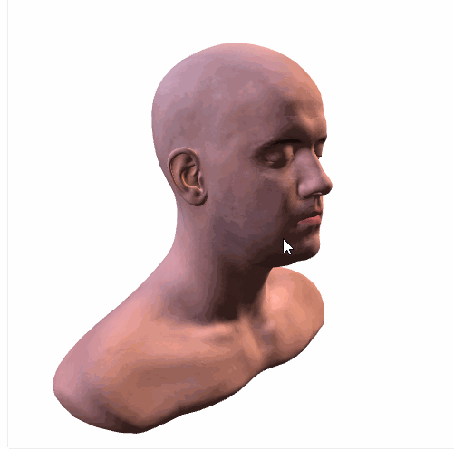

# vue-3d-model

<p align="center">
    <a href="https://www.npmjs.com/package/vue-3d-model"></a>
    <a href="https://travis-ci.org/hujiulong/vue-3d-model"></a>
    <a href="https://www.npmjs.com/package/vue-3d-model"></a>
</p>

vue.js 3D model viewer component, based on threejs, inspired by [model-tag](https://github.com/mrdoob/model-tag)

一个展示三维模型的Vue组件，支持模型操作和模型点击事件，能自动缩放模型到合适大小并校正偏移，支持多种格式的模型。

<p align="center">
  
</p>

## Example
[DEMO](https://hujiulong.github.io/vue-3d-model/#/demo-basic)

## Install
using npm
```
npm install vue-3d-model --save
```
Or using script tag for global use
```html
<script src="https://unpkg.com/vue-3d-model/dist/vue-3d-model.min.js"></script>
```

Or Download <a href="https://unpkg.com/vue-3d-model/dist/vue-3d-model.min.js">vue-3d-model.min.js</a> and include it in your html

## Usage

```vue
<template>
    <model-obj src="example/models/obj/LeePerrySmith.obj"></model-obj>
</template>
<script>
    import { ModelObj } from 'vue-3d-model'

    export default {
        components: { ModelObj }
    }
</script>
```
Or
```vue
<!DOCTYPE html>
<html>
<head>
    <meta charset="UTF-8">
</head>
<body>
    <div id="app">
        <model-obj src="example/models/obj/LeePerrySmith.obj"></model-obj>
    </div>
    <script src="vue.js"></script>
    <script src="vue-3d-model.min.js"></script>
    <script>
        new Vue({
            el: '#app'
        })
    </script>
</body>
```

## Documents

### props
| prop            | type          | default              |  example                                   |
| --------------- |---------------|----------------------|--------------------------------------------|
| src             | string        | -                    | './exapmle.obj'                            |
| width           | number        | -                    | 300                                        |
| height          | number        | -                    | 300                                        |
| position        | object        | { x: 0, y: 0, z: 0 } | { x: 100, y: 20, z: -10 }                  |
| rotation        | object        | { x: 0, y: 0, z: 0 } | { x: Math.PI / 2, y: 0, z: - Math.PI / 4 } |
| scale           | object        | { x: 1, y: 1, z: 1 } | { x: 2, y: 2, z: 3 }                       |
| lights          | array         | -                    |                                            |
| backgroundColor | number/string | 0xffffff             | 0xffffff/'#f00'/'rgb(255,255,255)'         |
| backgroundAlpha | number        | 1                    | 0.5                                        |
| controllable    | boolean       | true                 | true/false                                 |
| crossOrigin     | string        | anonymous            | anonymous/use-credentials                  |

### events

| event         |
| ------------- |
| on-mousedown  |
| on-mousemove  |
| on-mouseup    |
| on-click      |
| on-load       |
| on-progress   |
| on-error      |

## Model Format Support
| model format  | component tag     |
| ------------- |-------------------|
| obj           | \<model-obj>      |
| json          | \<model-three>    |
| stl           | \<model-stl>      |
| dae           | \<model-collada>  |
| ply           | \<model-ply>      |
| gltf(2.0)     | \<model-gltf>     |

## Browser Support
Modern browsers and IE 11.

You can click on [this](http://caniuse.com/#search=webgl) for more information

## TODO List
* Support for more model formats
* Animation
* Post-processing

## LICENSE
MIT
